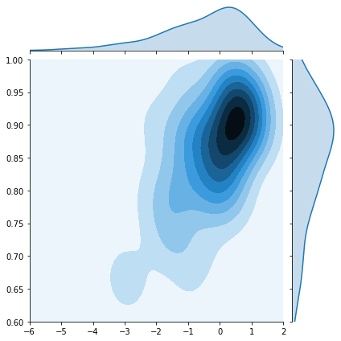

# SynthPop
SynthPop generates tabular synthetic data with gaussian copulas.

## Motivation
We want to model the joint distribution of {`X`,`y`} so we can draw more samples. Having more samples from a statistically identical distribution could (a) reduce overfitting or (b) preserve privacy (by creating a dataset with identical statistical properties without revealing groundtruth).

## Example
You have a few samples from the following distribution.


With SynthPop, you can generate more samples from that distribution by (a) fitting a Guassian copula to those observations and (b) drawing samples from that multivariate Gaussian.
```python
from SynthPop import Copula

data = np.load("data.npy")  # ground truth of 100 samples

Generator = Copula()
Generator.fit(data)  # fit a Guassian so it has a similar distribution
x1, x2 = Generator.sample(k=1000)  # draw as many samples as you need
```
By fitting on synthetic data, we can often improve model performance.